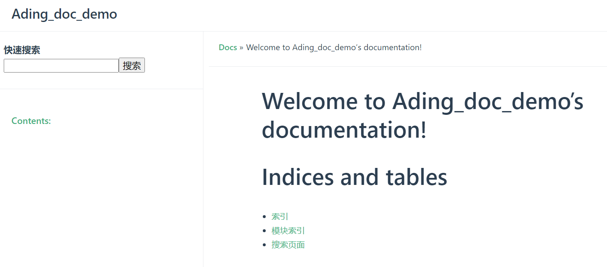
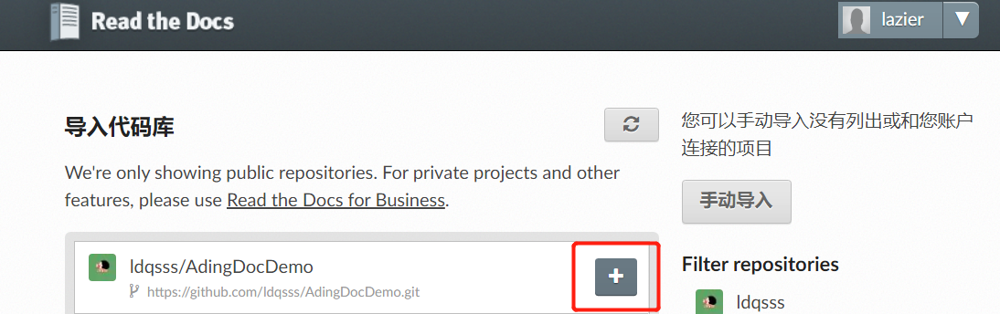
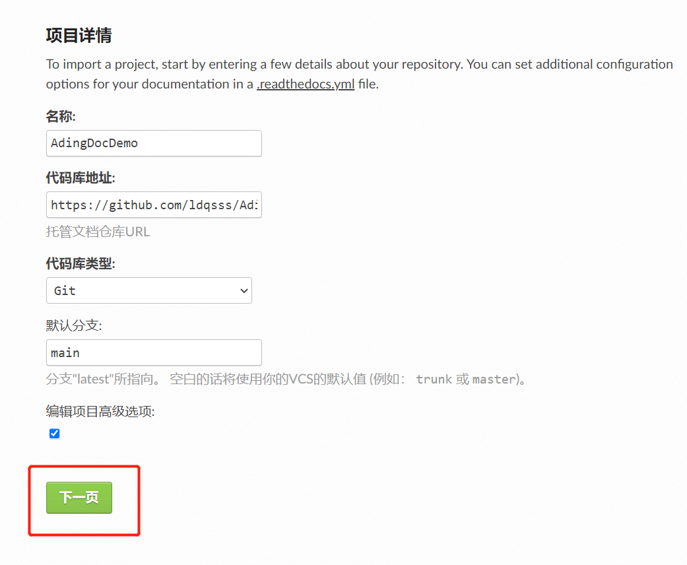
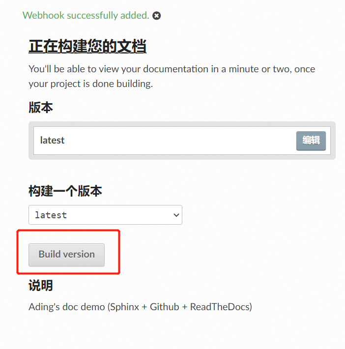

# 准备条件

1.   **`github`账号**
     使用[github](https://github.com/)对文档进行版本管理

2.   **注册`Read the Docs`账号**
     官网地址：https://readthedocs.org/

3.   **安装Python**
     [Sphinx](https://www.sphinx.org.cn/)是一个python工具，用于生成文档，所以需要安装Python环境。

# 开始装了

## 1. 安装Sphinx

```
pip install sphinx
```

## 2. 创建文档

创建一个GitHub仓库，clone到本地，在本地的仓库根目录创建文件夹`docs` （当然你可以命你喜欢的名）

然后再`docs`文件夹的命令行：

输入：`sphinx-quickstart`

```
Welcome to the Sphinx 4.5.0 quickstart utility.

Please enter values for the following settings (just press Enter to
accept a default value, if one is given in brackets).

Selected root path: .

You have two options for placing the build directory for Sphinx output.
Either, you use a directory "_build" within the root path, or you separate
"source" and "build" directories within the root path.
```

继续：`> Separate source and build directories (y/n) [n]: y`

```
The project name will occur in several places in the built documentation.
> Project name: Ading_doc_demo
> Author name(s): Ading
> Project release []: 1.0.0
```

再继续：

```
If the documents are to be written in a language other than English,
you can select a language here by its language code. Sphinx will then
translate text that it generates into that language.

For a list of supported codes, see
https://www.sphinx-doc.org/en/master/usage/configuration.html#confval-language.
> Project language [en]: zh_CN
```

默认是```en```

```
Finished: An initial directory structure has been created.

You should now populate your master file C:\***\AdingDocDemo\docs\source\index.rst and create other documentation
source files. Use the Makefile to build the docs, like so:
   make builder
where "builder" is one of the supported builders, e.g. html, latex or linkcheck.
```

第一步到此。

另外，

上面的配置可以选择默认，稍后修改生成的conf.py配置文件即可。

设置完成后，目录结构如下：

```
│  make.bat  编译脚本
│  Makefile
│  tt.txt
│  
├─build   存放编译后的文件
└─source
    │  conf.py 项目配置文件，上面的配置可以在这里面修改,譬如修改默认主题
    │  index.rst 首页
    │  
    ├─_static 存放静态文件
    └─_templates  存放模板文件
```

## 3. 编译

对`rst`文件进行编译生成HTML及相关静态文件：

\> `make html`

```
>make html
Running Sphinx v4.5.0
loading translations [zh_CN]... done
making output directory... done
building [mo]: targets for 0 po files that are out of date
building [html]: targets for 1 source files that are out of date
updating environment: [new config] 1 added, 0 changed, 0 removed
reading sources... [100%] index
looking for now-outdated files... none found
pickling environment... done
checking consistency... done
preparing documents... done
writing output... [100%] index
generating indices... genindex done
writing additional pages... search done
copying static files... done
copying extra files... done
dumping search index in Chinese (code: zh)... done
dumping object inventory... done
build succeeded.

The HTML pages are in build\html.
```

The HTML pages are in build\html.

然而默认的HTML Pages 不太亮眼

## 4.配置其它主题

1.    **下载安装对应的`sphinx Read the Docs`主题,** 

如下是安装 `rtd` 主题

 `pip install sphinx_rtd_theme`

如下是安装`press` 主题

`pip install sphinx_press_theme`

(更多主题可到官网:  https://sphinx-themes.org/ )

2.   **修改`source/conf.py`， 修改为[press](https://sphinx-themes.org/sample-sites/sphinx-press-theme/)主题.**

```
# html_theme = 'alabaster'  # 注释默认主题

html_theme = 'press'  # press 主题
```

3.   **重新编译，查看效果**

`make html`

(下面这张图使用, **英文,相对路径, 以及斜杠，而不是反斜杠**，不然make html的时候，这个md文件的图片不能找到。)：

``



## 5. 配置markdown

Sphinx默认使用 `reStructuredText` 标记语言，

现在配置使用`markdown`

1.   **安装recommonmark插件**

```bash
pip install recommonmark
```

2.   **安装支持markdown表格的插件**

```bash
pip install sphinx_markdown_tables
```

`ReadTheDocs`的python环境貌似没有sphinx_markdown_tables，在构建时可能报如下错误：

`ModuleNotFoundError: No module named 'sphinx_markdown_tables'`

解决方案:

1.   在docs目录下新建一个requirements.txt文件, 写入：

```
sphinx-markdown-tables==0.0.15
```

3.   **配置source/conf.py 文件**

```bash
extensions = [
	'recommonmark',
	'sphinx_markdown_tables'
]
```

4.   **提交上传**

`.gitignore`文件添加`docs/build/`目录，不需要上传这个目录。

```bash
git add .
git commit -m "提交说明"
git push -u origin master
```


## 6.配置文档内容

要配置文档内容，需要修改`index.rst`文件，它的内容如下

```
.. cpp_dictionary documentation master file, created by
   sphinx-quickstart on Wed Jul  7 09:42:42 2021.
   You can adapt this file completely to your liking, but it should at least
   contain the root `toctree` directive.
​
Welcome to cpp_dictionary's documentation!
==========================================
​
.. toctree::
   :maxdepth: 2
   :caption: Contents:
​
​
​
Indices and tables
==================
​
* :ref:`genindex`
* :ref:`modindex`
* :ref:`search`
​
```

语法:

-   两个点`..`+空格+后面的文本，代表注释
-   等号线`====`+上一行的文本，代表一级标题
-   `.. toctree::`声明的一个树状结构
-   `:maxdepth: 2` 表示页面的级数最多显示两级
-   `:caption: Contents:` 用于指定标题文本
-   最下面的3行是索引和搜索链接

# 关联Read the Docs

关联Read the Docs，使其可以在线访问文档。

浏览器访问 https://readthedocs.org/， 点击【我的项目】-> 【Import a Project】：

注意这里：

We're only showing public repositories. For private projects and other features, please use [Read the Docs for Business](https://readthedocs.com/).

所以最好是Public 仓库，如果是私有仓库，那得￥￥￥￥￥

点击下一页



之后点击完成， 最后构建版本



参考文档：

1.   [**搭建在线电子书：Sphinx + Github + ReadTheDocs** ](https://www.cnblogs.com/hiyong/p/15376880.html)

2.   **[配置文档内容](https://zhuanlan.zhihu.com/p/388640347)**